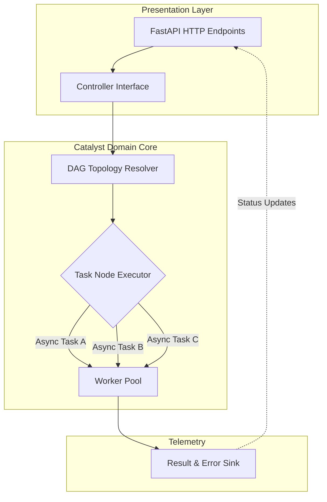

<div align="center">
  
  
  <br/>

  <h1>✨ Catalyst Engine</h1>
  <p><b>Parallel DAG Workflow Engine</b></p>
  <i>A high-performance, strictly-typed workflow engine for complex parallel pipelines. Zero bloat.</i>

  <br/>
  
  [](https://python.org)
  [](https://fastapi.tiangolo.com/)
  [](LICENSE)
</div>

---

## 📑 Table of Contents
- [🌟 Overview](#-overview)
- [🚀 Enterprise Features](#-enterprise-features)
- [🏗️ System Architecture](#️-system-architecture)
- [⚡ Quick Start Guide](#-quick-start-guide)
- [💻 Comprehensive Usage](#-comprehensive-usage)
- [🤝 Contributing](#-contributing)

---

## 🌟 Overview

**Catalyst Engine** is a heavily optimized, bare-metal Directed Acyclic Graph (DAG) executor written in pure Python. It is designed to orchestrate massively complex data pipelines and parallel tasks without the heavy overhead of frameworks like Airflow or Prefect. 

If you need raw execution speed, strict type safety, and seamless FastAPI integration, Catalyst is the engine for you.

---

## 🚀 Enterprise Features

- **⚡ Blazing Fast DAG Execution**: Resolves topological execution order in microseconds. Utilizes pure Python `asyncio` for non-blocking I/O parallel execution.
- **🛡️ Domain-Driven Design**: Clean, decoupled architecture separating the core domain logic from the presentation API.
- **🌐 FastAPI Dashboard**: Optional built-in API and visualization endpoints to monitor your DAGs in real-time.
- **💥 Graceful Failure Handling**: When an upstream task fails, the engine safely short-circuits, yielding a serializable JSON object describing the cascade instead of crashing the process.
- **🧩 Strict Typing**: Fully typed leveraging built-in Python generic types, fully compatible with strict `mypy` configurations.
- **🚫 Zero Wrapper Leaks**: Built with fail-fast optimization avoiding closure allocation overhead and preventing background task memory leaks.

---

## 🏗️ System Architecture



---

## ⚡ Quick Start Guide

### 1. Installation

Ensure you have `uv` installed for incredibly fast dependency resolution:
```bash
git clone https://github.com/shenald-dev/catalyst.git
cd catalyst
uv pip install -e .[dev]
```

### 2. Running the API Dashboard

Catalyst includes a FastAPI layer for interacting with your DAGs via HTTP.
```bash
uvicorn catalyst.presentation.api.main:app --reload --port 8080
```
Visit `http://localhost:8080/docs` to see the live Swagger UI.

---

## 💻 Comprehensive Usage

### Defining a Pipeline Code-First

You can bypass the API and use Catalyst entirely as a library within your own Python applications.

```python
import asyncio
from catalyst.domain.engine import DAGEngine
from catalyst.domain.models import TaskNode

async def fetch_data():
    return {"status": "fetched"}

async def process_data(data):
    return {"status": "processed", "input": data}

async def main():
    engine = DAGEngine()
    
    node_a = TaskNode(id="task_1", func=fetch_data)
    node_b = TaskNode(id="task_2", func=process_data, dependencies=["task_1"])
    
    engine.add_nodes([node_a, node_b])
    
    results = await engine.execute()
    print(results)

asyncio.run(main())
```

---

## 🤝 Contributing
Join the flow state and help us make Catalyst even faster! 🚀

- 🐛 **Found a bug?** Open an issue.
- ✨ **Have a feature idea?** We are open to PRs! Just make sure to run `ruff format` and keep the typed codebase pristine.

---
> *Built by a Vibe Coder. Focused on Performance.*
